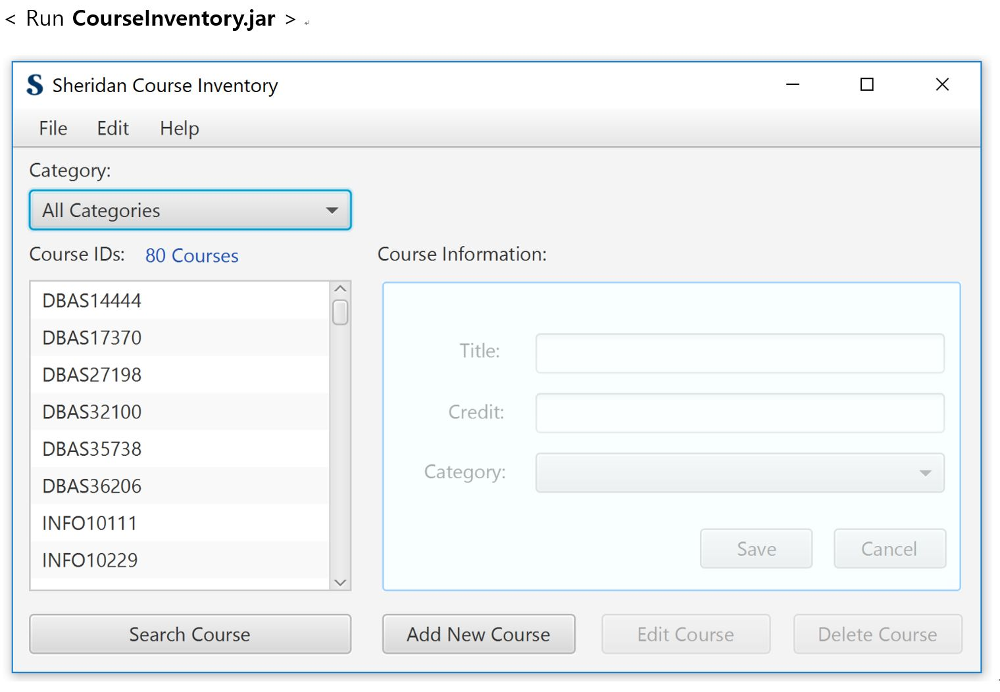
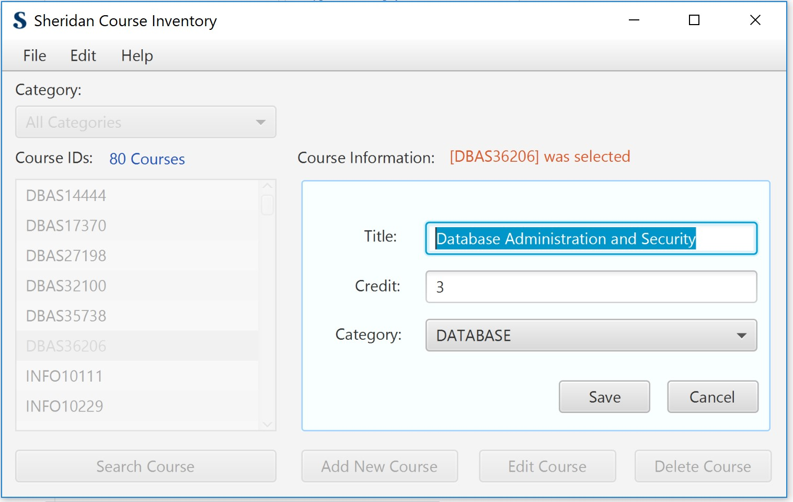
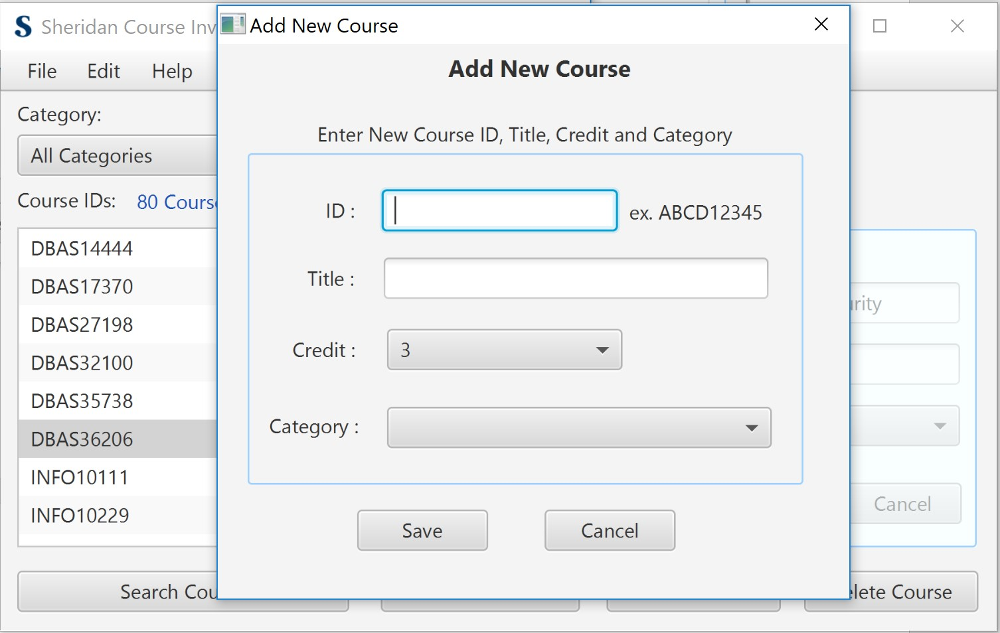
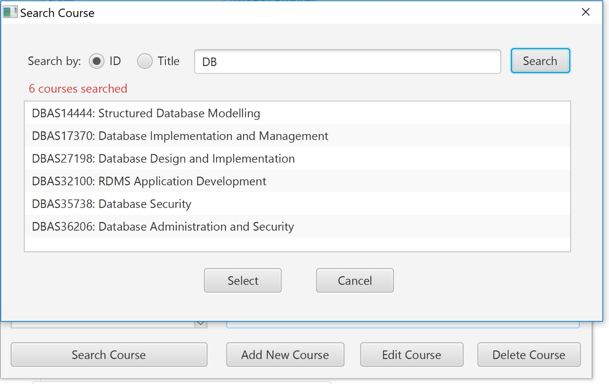

# Java Project - College Course Inventory Manager 

@ Java Bean, Java FX for Window Form 

@ created date : April 2018

 Overview
------------------------

This project is developing a GUI application using  JavaFX framework. 
It is based on College Course Inventory and the data is saved  in specific file. 
  

 Project Description
------------------------

1. The ability to add, edit, and delete records in the file.

2. The data validation when add or delete a record.

3. The confirmation of user when delete or modify a record.

4. All changes to the records should be applied to the data file.

5. The ability to navigate all records in the file.

6. The ability to search for records in the file.

 
 Program Funtionality
-------------------------

- File I/O: read and write  items

- Search items

- Edit items

- Add items

- Delete items

- Sorting items

Program Features
------------------------

- Main window for searching, modifying, deleting courses 

- sub window for adding new course informaion

- sub window for searching course with keyword

